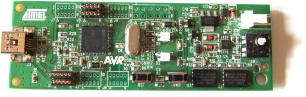

.. _fview_ext_trig-overview:

**********************************************************
Camera trigger device with precise timing and analog input
**********************************************************

.. index::
  single: fview_ext_trig
  single: analog input
  single: synchronization

.. _camtrig:

camtrig -- Camera trigger device firmware
=========================================

**camtrig** - firmware for precisely timed trigger generation with
synchronized analog input

Why
---

Triggering your camera is useful to synchronize it with other
devices. These other devices can be other cameras, so that images are
taken simultaneously, or a computer, so that the images can be
correlated with other activity.

What
----

Camtrig is firmware for the $30 AT90USBKEY__ USB development board
that:

__ http://atmel.com/dyn/products/tools_card.asp?tool_id=3879

1. generates trigger pulses to feed into the external trigger input of
   digital video cameras.  The pulses are generated with a 16-bit
   hardware timer using an 8 MHz crystal oscillator to produce very
   regular timing.
2. communicates synchronization information with software running on a
   PC. By repeatedly querying for timestamps from the USB device, the
   PC is able to make a model of the gain and offset of the two clocks
   with computed precision.
3. acquires analog voltage streams. The AT90USBKEY has a multiplexed
   10-bit analog-to-digital converter (ADC), which can sample from 0.0
   to 3.3 volts and operates up to 9.6 KHz using
   :mod:`motmot.fview_ext_trig`.
4. produces digital pulses to trigger other hardware.
5. provides a GUI plugin to :mod:`fview` that includes a display like a
   strip-chart recorder. This plugin is :mod:`motmot.fview_ext_trig`.

.. image:: screenshot-small.png

How
---

The device is accessed using the Python :mod:`motmot.fview_ext_trig` package.

Camtrig is built with GCC-AVR using the LUFA_ library for the
AT90USBKEY. To load the firmware onto the device, use
`dfu-programmer`__ or FLIP__ to transfer the hex file camtrig.hex_ to
the device in Device Firmware Upload (DFU) mode.

__ http://dfu-programmer.sourceforge.net/
__ http://www.atmel.com/dyn/products/tools_card.asp?tool_id=3886

Where
-----

The source code for the camera trigger device is kept in the
`fview_ext_trig git repository`_ under the `CamTrigUSB directory`_.
Alternatively, download the released Python code at the `PyPI page`_
and the firmware, camtrig.hex_, from github.

.. _fview_ext_trig git repository: http://github.com/motmot/fview_ext_trig/tree/master/
.. _CamTrigUSB directory: http://github.com/motmot/fview_ext_trig/tree/master/CamTrigUSB
.. _motmot: http://code.astraw.com/projects/motmot
.. _LUFA: http://www.fourwalledcubicle.com/LUFA.php
.. _PyPI page: http://pypi.python.org/pypi/motmot.fview_ext_trig
.. _camtrig.hex: http://github.com/motmot/fview_ext_trig/raw/master/CamTrigUSB/Projects/MotmotCamTrig/camtrig.hex

More information
----------------

.. toctree::
  :maxdepth: 1

  README-firmware.rst
  wiring.rst
