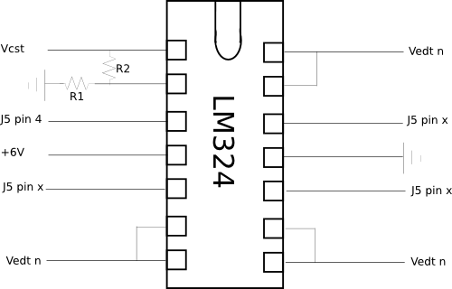
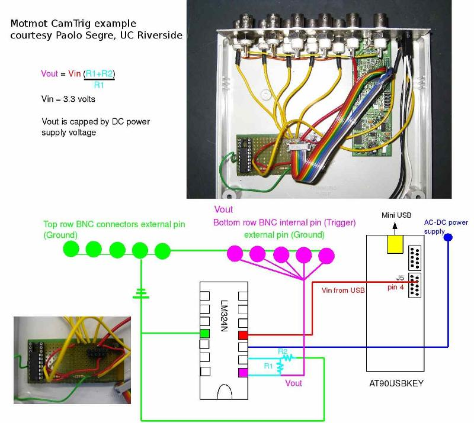

Wiring the motmot camera trigger
================================

We have been connecting the AT90USBKEY in the following way. We hope
to provide details on a canoncial enclosure soon.

Connection details
------------------

========================= ================== =================== =======
Signal                    AT90USBKEY contact AT90USB1287 contact Op-Amp
========================= ================== =================== =======
Camera Sync Trigger       J5 pin 4           C6, OCR3A           optional
External Device Trigger 1 J5 pin 9           C1                  optional
External Device Trigger 2 J5 pin 8           C2                  optional
External Device Trigger 3 J5 pin 7           C3                  optional
Analog input 0            J1 pin 10          F0
Analog input 1            J1 pin 9           F1
Analog input 2            J1 pin 8           F2
Analog input 3            J1 pin 7           F3
Ground                    J5 pin 2, J1 pin 2
========================= ================== =================== =======

Optional 5V outputs
-------------------

An optional Op-Amp may be used to boost the output signal voltage from
3.3V to 5.0V and provide more current. Furthermore, it should provide
a degree of protection to the microcontroller from from adverse
connections.

In the drawing above, V\ :sub:`CST` is the Camera Sync Trigger, V\
:sub:`ETD n` are the External Device Triggers. J5 refers to the jumper
on the AT90USBKEY device. The resistors should be chosen to give the
appropriate gain. Values of 100 ohms for R1 and 200 ohms for R2 will
give a 3x gain, which will saturate the op-amp given a 6V power supply
and a 3.3V input from the AT90USB device. The +6 V power is taken from
an external power supply, which can be connected into the trigger box
via the provided plug.

Example implementation
----------------------

Andrew Straw built the trigger device pictured below, which was
photographed and illustrated by Paolo Segre. It is meant to trigger
multiple cameras from the Camera Sync Trigger pin, and thus brings
this amplified signal out to the bottom row of BNC connectors. (The
top row of BNCs is available for exansion and is currently unused.)

